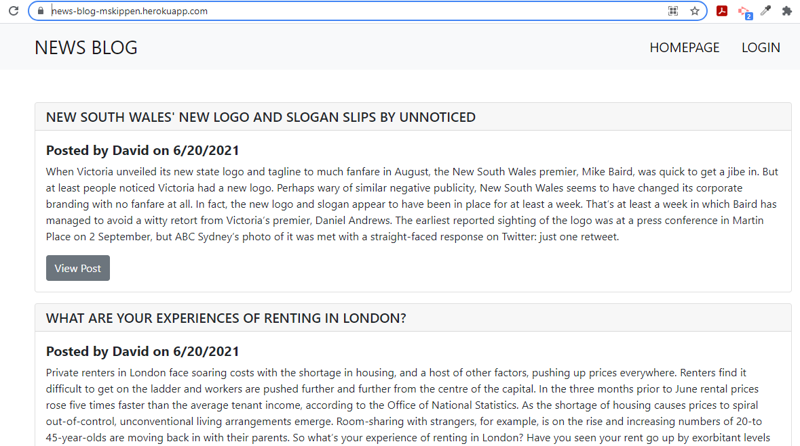
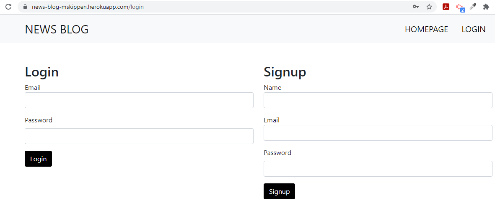
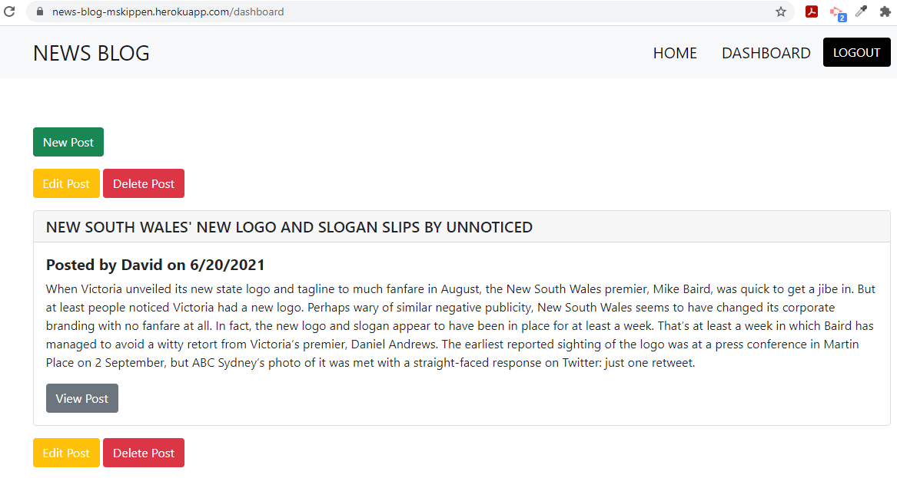
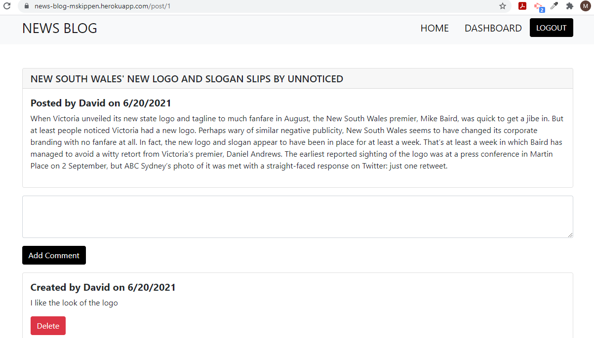

# 14 News Blog

## The site

This is a CMS-style blog site similar to a Wordpress site has been built, where journalists can publish their blog posts and comment on other journalists' posts as well.

## User Story

```md
AS A journalist who writes about news
You WANT a CMS-style blog site
SO THAT you can publish articles, blog posts, and your thoughts and opinions
```

## Acceptance Criteria

```md
GIVEN a CMS-style blog site
WHEN you visit the site for the first time
THEN you are presented with the homepage, which includes existing blog posts if any have been posted; navigation links for the homepage and the dashboard; and the option to log in
WHEN you click on the homepage option
THEN you am taken to the homepage
WHEN you click on any other links in the navigation
THEN you are prompted to either sign up or sign in
WHEN you choose to sign up
THEN you are prompted to create a username and password
WHEN you click on the sign-up button
THEN your user credentials are saved and you are logged into the site
WHEN you revisit the site at a later time and choose to sign in
THEN you are prompted to enter my username and password
WHEN you are signed in to the site
THEN you see navigation links for the homepage, the dashboard, and the option to log out
WHEN you click on the homepage option in the navigation
THEN you are taken to the homepage and presented with existing blog posts that include the post title and the date created
WHEN you click on an existing blog post
THEN you are presented with the post title, contents, post creator’s username, and date created for that post and have the option to leave a comment
WHEN you enter a comment and click on the submit button while signed in
THEN the comment is saved and the post is updated to display the comment, the comment creator’s username, and the date created
WHEN you click on the dashboard option in the navigation
THEN you are taken to the dashboard and presented with any blog posts I have already created and the option to add a new blog post
WHEN you click on the button to add a new blog post
THEN you are prompted to enter both a title and contents for my blog post
WHEN you click on the button to create a new blog post
THEN the title and contents of your post are saved and you are taken back to an updated dashboard with your new blog post
WHEN you click on one of your existing posts in the dashboard
THEN you are able to delete or update your posts and taken back to an updated dashboard
WHEN you click on the logout option in the navigation
THEN you are signed out of the site
WHEN you are idle on the page for more than a set time
THEN you are automatically signed out of the site 
```

## Mock-Up

The following images demonstrates the application functionality:

Home

Login

Dashboard

Post


## Links

* The URL of the functional, deployed application: <https://news-blog-mskippen.herokuapp.com/>

* The URL of the GitHub repository, with a unique name and a readme describing the post: <https://github.com/mskippen/14-News-Blog.git>

---
© 2021 Project Agents Pty Ltd. All Rights Reserved.